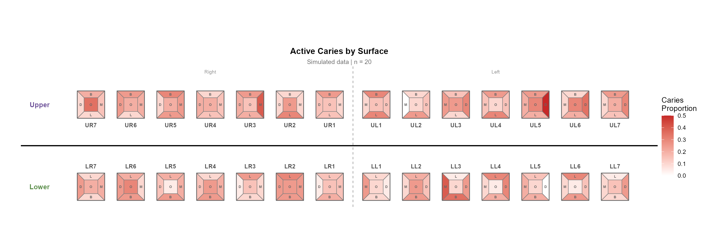
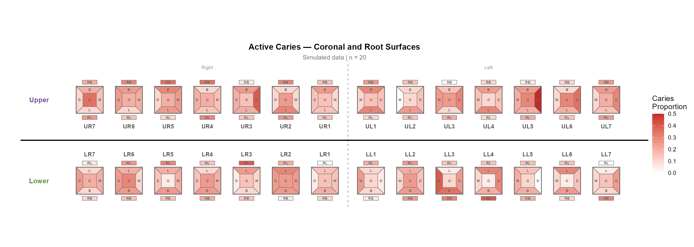
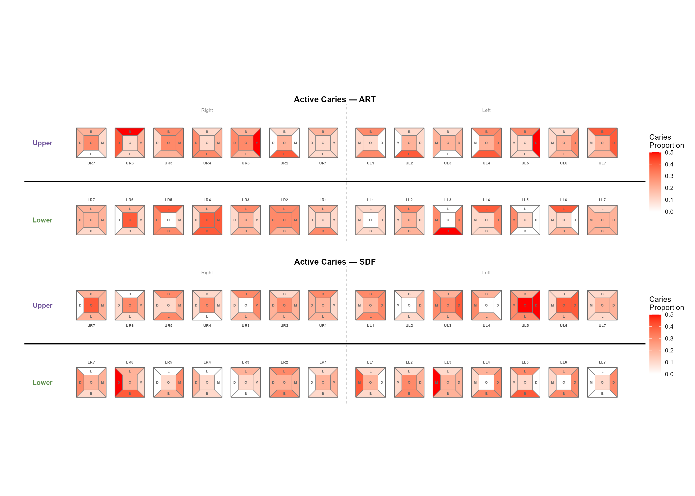

# tooth 

<!-- badges: start -->
<!-- badges: end -->

**tooth** is an R package for dental public health research. It provides
standardised caries index calculations and publication-ready odontograph
heatmap visualisations from clinical examination data.

## Why tooth?

Dental epidemiological studies routinely compute DMFT/DMFS indices and
visualise caries patterns across the dental arch, yet there is no
dedicated R package for these tasks. Researchers typically write ad-hoc
scripts with hardcoded ICDAS thresholds and manual ggplot2 layouts.
**tooth** replaces those one-off scripts with tested, documented,
flexible functions that work across study designs.

## Features

- **Caries indices** — DMFT/dmft and DMFS/dmfs with configurable ICDAS
  thresholds, activity codes, and restoration codes. One function call
  replaces 30+ lines of `mutate()`/`group_by()`/`summarise()`.
- **Root vs coronal separation** — Tally root caries (`RDT`, `RDS`)
  independently from coronal indices in the same call.
- **Odontograph heatmaps** — Colour-coded dental arch diagrams with
  5 coronal surfaces (B, L, M, D, O) and up to 4 root surfaces
  (RB, RL, RM, RD) per tooth.
- **Flexible dentition** — Primary (5 teeth/quadrant) or permanent
  (5–8 teeth/quadrant).
- **Stratification** — Facet odontographs by treatment arm, site,
  time-point, or any grouping variable with customisable panel labels.
- **Long or wide input** — Auto-pivots wide-format data to long.
- **Tooth numbering** — Convert between FDI (ISO 3950), Universal (ADA),
  and quadrant notation.

## Installation

```r
# From GitHub
devtools::install_github("ddmsel/tooth")

# From local tarball
install.packages("tooth_0.4.0.tar.gz", repos = NULL, type = "source")
```

## Gallery

### Coronal surfaces

```r
build_odontograph(
  data = decay_data,
  teeth_per_quadrant = 7,
  surfaces = c("buc", "lin", "mes", "dis", "occ"),
  title = "Active Caries by Surface"
)
```


### With root surfaces

```r
build_odontograph(
  data = decay_data,
  teeth_per_quadrant = 7,
  surfaces = c("buc", "lin", "mes", "dis", "occ", "rootb", "rootl"),
  title = "Active Caries — Coronal and Root Surfaces"
)
```



### Stratified by treatment arm

```r
build_odontograph(
  data = decay_by_trt,
  teeth_per_quadrant = 7,
  strata = "treatment",
  strata_labels = c("1" = "SDF", "2" = "ART + FV"),
  title = "Active Caries"
)
```



### Clean look (no surface labels)

```r
build_odontograph(
  data = decay_data,
  teeth_per_quadrant = 7,
  show_labels = FALSE,
  title = "Active Caries — No Surface Labels"
)
```


## Quick Start

### DMFT calculation

```r
library(tooth)
data(sim_exam)

# Basic DMFT from surface-level ICDAS data
dmft <- calc_dmft(sim_exam)
head(dmft)
#>   record_id DT FT MT DFT DMFT num_teeth DT_yn DFT_yn

# With repeated measures and stratification
dmft <- calc_dmft(
  sim_exam,
  group = "redcap_event_name",
  strata = "treatment"
)

# Separate root caries
dmft <- calc_dmft(sim_exam, root_lesion_col = "lesion_code")
# Returns DT (coronal) + RDT (root) separately
```

### DMFS calculation

```r
dmfs <- calc_dmfs(sim_exam)
dmfs <- calc_dmfs(sim_exam, root_lesion_col = "lesion_code")
```

### Custom ICDAS thresholds

```r
calc_dmft(
  data,
  decayed_codes  = c(3, 4, 5, 6),
  activity_codes = c(2),
  filled_codes   = c(1, 2),
  present_codes  = c(2, 3, 4, 5),
  missing_codes  = c(1)
)
```

### Wide format input

```r
# Columns like: ur1_buc_les, ur1_buc_fil, ur1_buc_act, ur1_code
calc_dmft(wide_data, format = "wide")
```

### Tooth numbering conversion

```r
tooth_convert("11", from = "fdi", to = "quadrant")
#> "ur1"

tooth_convert("ur1", from = "quadrant", to = "universal")
#> "8"

tooth_convert(c("11", "21", "36", "46"), from = "fdi", to = "quadrant")
#> "ur1" "ul1" "ll6" "lr6"
```

## Functions

| Function | Description |
|---|---|
| `build_odontograph()` | Full-arch surface heatmap with stratification |
| `draw_tooth()` | Single tooth polygon geometry (9 surfaces) |
| `calc_dmft()` | DMFT/dmft with root/coronal separation |
| `calc_dmfs()` | DMFS/dmfs with root/coronal separation |
| `pivot_to_long()` | Wide → long format converter |
| `tooth_config()` | Arch layout configuration |
| `tooth_convert()` | FDI ↔ Universal ↔ quadrant numbering |

## Citation

If you use **tooth** in published research, please cite it:

```
Selvaraj D (2026). tooth: Dental Public Health Indices and Odontograph
Visualizations. R package version 0.4.0.
https://github.com/ddmsel/tooth
```

## Contributing

Issues and pull requests welcome at
[github.com/ddmsel/tooth](https://github.com/ddmsel/tooth/issues).

## License

MIT
