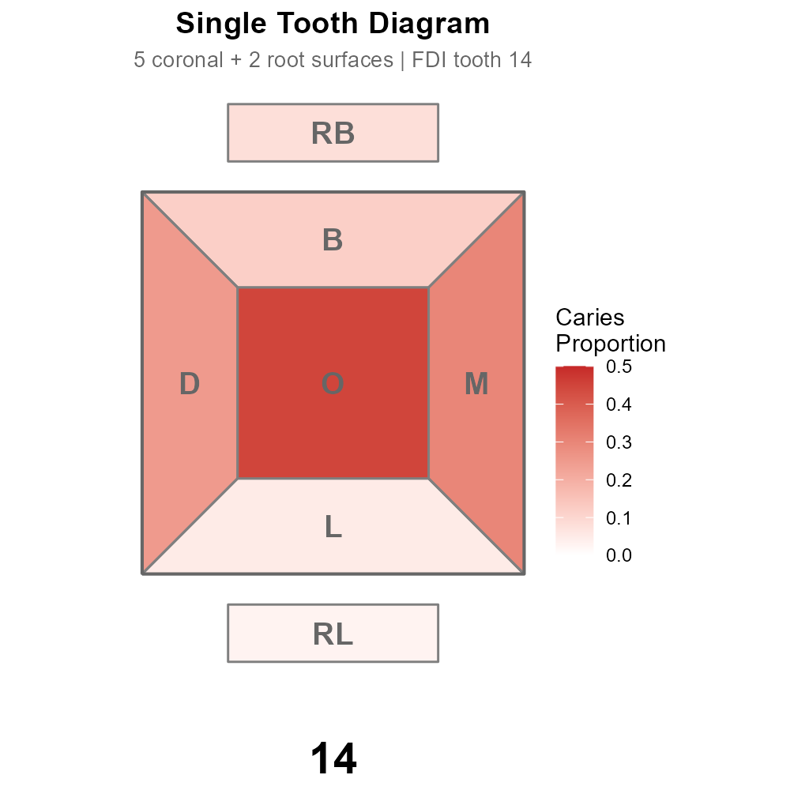
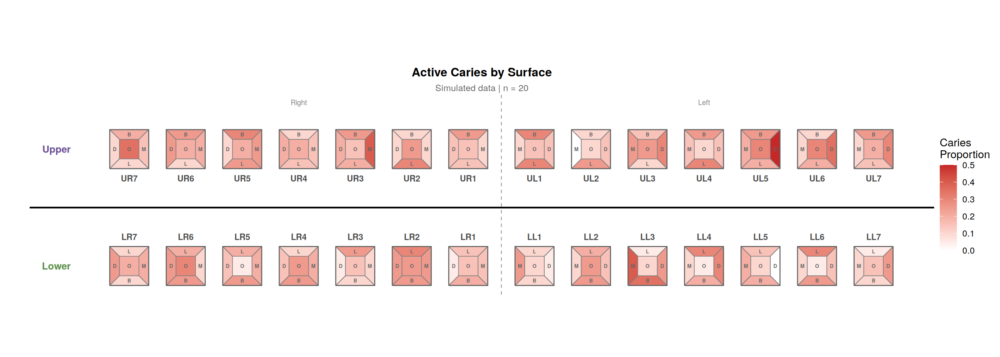
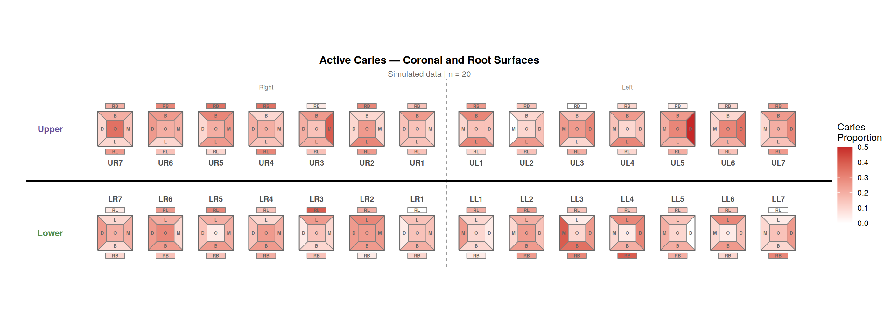
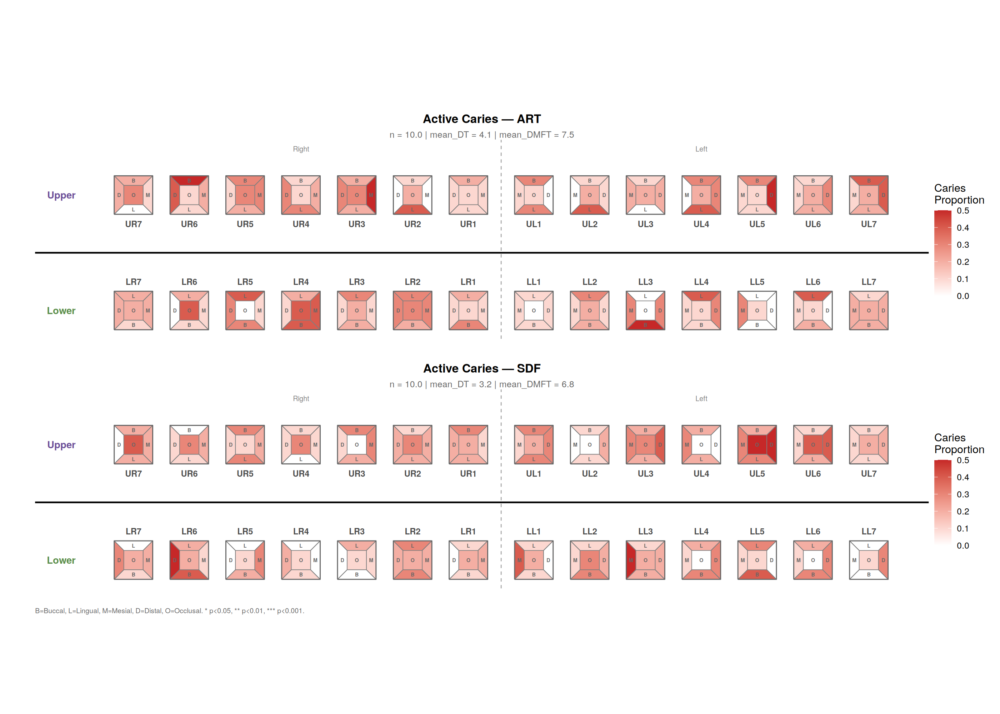
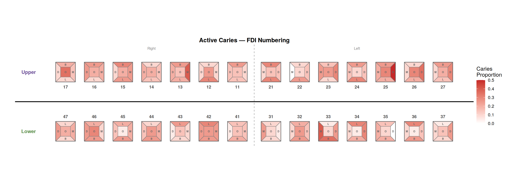
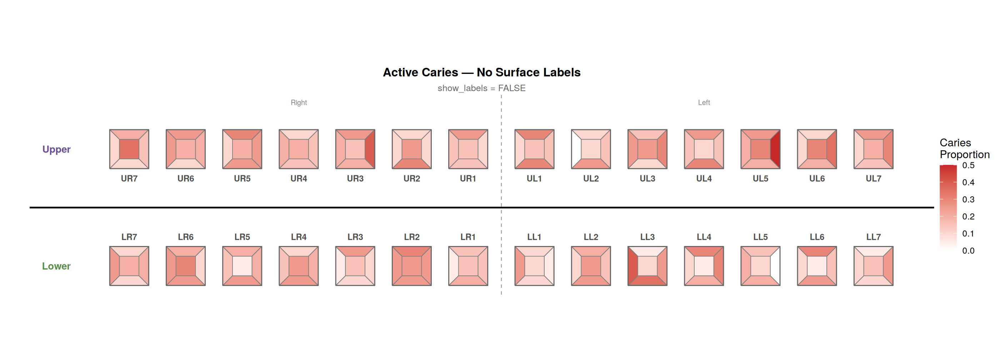

# tooth

<!-- badges: start -->
<!-- badges: end -->



**tooth** is an R package for dental public health research. It computes
standardised caries indices and produces publication-ready odontogram
heatmap visualisations from clinical examination data.

Each tooth is drawn as a five-surface crown diagram with optional root
surface bars. Surface values are mapped to a colour gradient so you can
see caries patterns, treatment outcomes, or any per-surface metric at a
glance across the full dental arch.

### Crown surfaces

| Abbreviation | Surface | Description |
|---|---|---|
| **B** | Buccal | Cheek-facing surface |
| **L** | Lingual | Tongue-facing surface |
| **M** | Mesial | Forward-facing interproximal surface |
| **D** | Distal | Backward-facing interproximal surface |
| **O** | Occlusal | Biting/chewing surface |

### Root surfaces

| Abbreviation | Surface | Description |
|---|---|---|
| **RB** | Root-Buccal | Root surface on the cheek side |
| **RL** | Root-Lingual | Root surface on the tongue side |
| **RM** | Root-Mesial | Root surface on the mesial side |
| **RD** | Root-Distal | Root surface on the distal side |

## Why tooth?

Dental epidemiological studies routinely compute DMFT/DMFS indices and
visualise caries distributions, yet there is no dedicated R package for
these tasks. Researchers write ad-hoc scripts with hardcoded ICDAS
thresholds and manual ggplot layouts for every new project. **tooth**
replaces those one-off scripts with tested, documented, flexible
functions that work across study designs — primary or permanent
dentition, 5 to 8 teeth per quadrant, coronal and root caries, long or
wide data formats.

## Features

- **Caries indices** — DMFT/dmft and DMFS/dmfs with configurable ICDAS
  thresholds, activity codes, and restoration codes
- **Root vs coronal separation** — Tally root caries (`RDT`, `RDS`)
  independently from coronal indices
- **Odontogram heatmaps** — Colour-coded dental arch diagrams with up
  to 9 surfaces per tooth (B, L, M, D, O, RB, RL, RM, RD)
- **Flexible dentition** — Primary (5 teeth/quadrant) or permanent
  (5–8 teeth/quadrant)
- **Stratification with statistics** — Facet by treatment arm with
  sample size (n), mean DMFT, mean DT, and significance stars
  (t-test or Wilcoxon rank-sum)
- **Tooth numbering** — Display in quadrant, FDI (ISO 3950), or
  Universal (ADA) notation
- **Manual heatmap range** — `min_val`/`max_val` for consistent colour
  scales across multiple plots
- **Surface label toggle** — `show_labels = FALSE` for clean exports
- **Adjustable tooth label size** — `tooth_label_size` for readability
- **Custom strata titles** — `strata_labels` to rename panel headings
- **Footnotes** — Abbreviation keys and p-value definitions via `footnote`
- **Smart spacing** — Automatically widens tooth gaps when root-mesial
  (RM) and root-distal (RD) surfaces are displayed
- **Long or wide input** — Auto-pivots wide-format data to long
- **Tooth numbering conversion** — FDI ↔ Universal ↔ quadrant

## Installation

```r
# From GitHub
devtools::install_github("ddmsel/tooth")

# From local tarball
install.packages("tooth_0.5.0.tar.gz", repos = NULL, type = "source")
```

## Gallery

### Single tooth diagram

Each tooth is a five-wedge crown (B, L, M, D, O) with optional root
bars (RB, RL), labelled by surface and coloured by value.


### Coronal surfaces — full arch

```r
build_odontogram(
  data = decay_data,
  teeth_per_quadrant = 7,
  surfaces = c("buc", "lin", "mes", "dis", "occ")
)
```



### With root-buccal (RB) and root-lingual (RL) surfaces

```r
build_odontogram(
  data = decay_data,
  surfaces = c("buc", "lin", "mes", "dis", "occ", "rootb", "rootl")
)
```



### Stratified with summary statistics and footnote

```r
stats_df <- data.frame(
  treatment = c("SDF", "ART"),
  n = c(120, 115),
  mean_DT = c(2.3, 2.8),
  mean_DMFT = c(5.1, 5.6)
)

build_odontogram(
  data = decay_by_trt,
  strata = "treatment",
  stats = stats_df,
  footnote = "B=Buccal, L=Lingual, M=Mesial, D=Distal, O=Occlusal.\n* p<0.05, ** p<0.01, *** p<0.001."
)
```



### FDI tooth numbering

```r
build_odontogram(data = decay_data, numbering = "fdi")
```



### No surface labels

```r
build_odontogram(data = decay_data, show_labels = FALSE)
```



## Quick Start

### DMFT calculation

```r
library(tooth)
data(sim_exam)

# Basic DMFT
dmft <- calc_dmft(sim_exam)

# With stratification
dmft <- calc_dmft(sim_exam, strata = "treatment")

# Separate root caries
dmft <- calc_dmft(sim_exam, root_lesion_col = "lesion_code")
# Returns DT (coronal) + RDT (root) separately
```

### Odontogram with all options

```r
build_odontogram(
  data             = decay_data,
  value_col        = "prop",
  teeth_per_quadrant = 7,
  title            = "Caries Distribution",
  surfaces         = c("buc", "lin", "mes", "dis", "occ"),
  show_labels      = TRUE,
  tooth_label_size = 3,
  numbering        = "fdi",
  min_val = 0, max_val = 0.5,
  strata           = "treatment",
  strata_labels    = c("1" = "SDF", "2" = "ART + FV"),
  stats            = stats_df,
  stats_test       = "wilcox",
  stats_var        = "mean_DMFT",
  stats_raw        = raw_patient_data,
  footnote         = paste0(
    "B=Buccal, L=Lingual, M=Mesial, D=Distal, O=Occlusal.\n",
    "* p<0.05, ** p<0.01, *** p<0.001 (Wilcoxon rank-sum test)."
  )
)
```

### Tooth numbering conversion

```r
tooth_convert("11", from = "fdi", to = "quadrant")
#> "ur1"

tooth_convert("ur1", from = "quadrant", to = "fdi")
#> "11"
```

## All Functions

| Function | Description |
|---|---|
| `build_odontogram()` | Full-arch heatmap with stratification, stats, numbering |
| `draw_tooth()` | Single tooth polygon geometry (up to 9 surfaces) |
| `calc_dmft()` | DMFT/dmft with root/coronal separation |
| `calc_dmfs()` | DMFS/dmfs with root/coronal separation |
| `pivot_to_long()` | Wide → long format converter |
| `tooth_config()` | Arch layout configuration |
| `tooth_convert()` | FDI ↔ Universal ↔ quadrant numbering |

## Citation

If you use **tooth** in published research, please cite:

```
Selvaraj D (2026). tooth: Dental Public Health Indices and Odontogram
Visualizations. R package version 0.5.0.
https://github.com/ddmsel/tooth
```

## License

MIT
